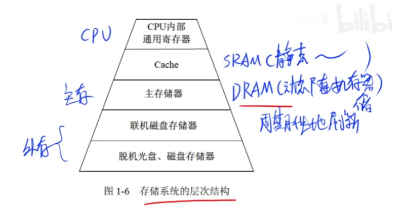

## 计算机系统

### CPU 相关
中央处理单元CPU：由运算器和控制器构成，它负责获取程序指令，对指令进行译码并执行。
- 运算器：
  - 算术逻辑单元ALU：各种运算，如加减乘除、逻辑运算、位运算等。
  - 累加寄存器AC：为ALU提供工作区，暂存运算结果。
  - 数据缓冲寄存器DR：为CPU提供数据交换的缓冲区。
  - 状态条件寄存器PSW：状态标志、控制标志。
- 控制器：
  - 指令寄存器IR：寄存指令。
  - 程序计数器PC：下一条指令的地址，直接PC+1或者跳转。
  - 地址寄存器AR：保存当前CPU所访问的内存单元的地址。
  - 指令译码器ID：解释操作码。（指令=操作码+地址码） 

### 基本单位
最小数据单位是位(bit)，最小存储单位是字节(byte)。

n进制加减法：加法逢n加1，减法借1当n。

### 原码、反码、补码、移码

### 浮点数

### 寻址

### 海明码、奇偶校验码、循环冗余校验码

### RISC 和 CISC
RISC: 精简指令集计算机

CISC: 复杂指令集计算机

|          | RISC 精简          | CISC 复杂 |
|----------|------------------|---------|
| 指令种类     | 少、精简             | 多、丰富    |
| 指令复杂度    | 低（简单）            | 高（复杂）   |
| 指令长度     | 固定               | 变化      |
| 寻址方式     | 少                | 复杂多样    |
| 实现（译码）方式 | 硬布线控制逻辑（组合逻辑控制器） | 微程序控制技术 |
| 通用寄存器数量  | 多、大量             | 一般      |
| 流水线技术    | 支持               | 不支持     |

### 流水线
操作周期 = max(每段所需时间)

流水线时间：第一条指令执行时间 + (n - 1) * 操作周期

加速比 = 不采用流水线的执行时间 / 采用流水线的执行时间

吞吐率 = 1 / 操作周期

执行n条指令的吞吐率 = n / 流水线时间

### 存储器

1. 按**位置**分类：内存（主存）、外存（辅存）
2. 按**工作方式**分类：读/写存储器(RAM)、只读存储器(ROM)
3. 按**访问方式**分类：按地址访问的存储器、按内容访问的存储器
4. 按**寻址方式**分类：随机存储器、顺序存储器、直接存储器

相连存储器是一种按内容访问的存储器。

虚拟存储器由主存和辅存构成。

主存主要由DRAM（动态随机存储器，特性：需要周期性地刷新来保持数据）组成。

### 高速缓存Cache
位于CPU和主存之间的存储器，用于存储CPU最近访问过的数据，以减少主存访问次数。

CPU判断要访问的信息是否在Cache中，若在，则命中，对Cache寻址，否则未命中，根据替换原则决定主存的哪一块信息替换到Cache的哪一块里。

替换算法：随机替换算法、先进先出算法、近期最少使用算法、优化替换算法。

地址映像：主存地址转换成Cache地址，有三种映射方式：
1. 直接映像：缓存的n块映射主存的某一区域的n块，冲突多
2. 全相联映像：允许映像任意一块，冲突少
3. 组相联映像：主存的n组映射缓存的n组，组内确保全相联，冲突较少。

**Cache对程序员来说是透明的，它与主存的地址映射由硬件自动完成。**

### 中断
1. 中断向量：提供中断服务程序的入口地址
2. 中断响应时间：发出中断请求开始，到进入中断服务程序
3. 保存现场：保存源程序，处理完中断后返回来执行源程序

